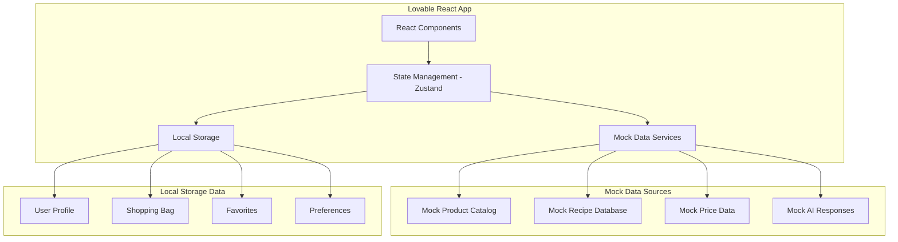
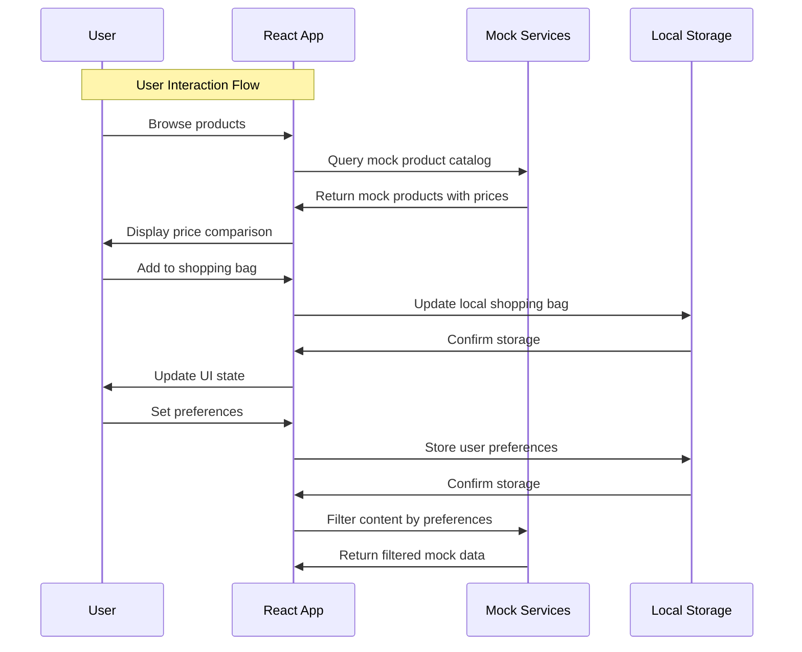

# SuperMarty MVP Lovable Prototype Design Document

## Overview

SuperMarty is a comprehensive grocery shopping assistant prototype built exclusively using Lovable to demonstrate the complete user experience for price comparison across Dutch supermarkets (Albert Heijn, Jumbo, Plus), meal planning, and personalized dietary recommendations. This prototype creates a fully functional mobile app experience using carefully crafted mock data and browser local storage to validate the product concept, user interface design, and complete user journey flows.

The architecture leverages Lovable's React-based framework with TypeScript, utilizing browser local storage for all user-generated content and comprehensive static mock data sets to simulate the complete SuperMarty ecosystem without requiring any backend infrastructure. The design prioritizes mobile-first responsive design with Dutch localization, accessibility compliance, and realistic data interactions that demonstrate the full product vision.

## Architecture

### High-Level Prototype Architecture



### Data Flow Architecture



## Components and Interfaces

### Frontend Architecture (React + TypeScript)

The Lovable React application follows a component-based architecture with Zustand for state management:

#### Core Services Layer
- **MockDataService**: Provides comprehensive mock product, recipe, and pricing data
- **LocalStorageService**: Manages persistent local storage for user data
- **ShoppingBagService**: Handles shopping cart operations with local persistence
- **PriceComparisonService**: Calculates price comparisons using mock data
- **MockCheckoutService**: Simulates checkout flow with realistic interactions
- **MockAIService**: Provides pre-scripted AI assistant responses
- **UserProfileService**: Manages local user profile and preferences

#### Project Structure
```
src/
├── components/       # Reusable UI components
├── pages/           # Main application screens
├── services/        # Business logic and data services
├── stores/          # Zustand state management stores
├── types/           # TypeScript type definitions
├── data/            # Mock data files and generators
├── utils/           # Helper functions and constants
├── hooks/           # Custom React hooks
└── App.tsx          # Application entry point
```

### Backend Architecture (Supabase)

#### Database Schema Design

**Core Product System:**
- `supermarkets`: Store information about supermarket chains
- `categories`: Hierarchical product categorization
- `shadow_products`: Abstract product entities for price comparison
- `products`: Specific product instances from each supermarket
- `product_matches`: Automated and manual product matching records
- `nutritional_info`: Product nutritional data

**User Management:**
- `users`: Managed by Supabase Auth
- `user_profiles`: Non-sensitive user information
- `health_profiles`: GDPR-compliant sensitive health data with RLS

**Shopping and Content:**
- `shopping_bags` & `shopping_bag_items`: User's personal shopping cart
- `recipes` & `recipe_ingredients`: Meal planning content
- `meal_plans` & `meal_plan_recipes`: Curated meal collections
- `curated_bags` & `curated_bag_items`: Admin-created product collections
- `favorites`: Polymorphic user favorites system

#### Row-Level Security (RLS) Policies

```sql
-- Health profiles: Users can only access their own data
CREATE POLICY "Users can view own health profile" ON health_profiles
    FOR SELECT USING (auth.uid() = user_id);

-- Shopping bags: Users can only access their own bags
CREATE POLICY "Users can manage own shopping bags" ON shopping_bags
    FOR ALL USING (auth.uid() = user_id);

-- Favorites: Users can only manage their own favorites
CREATE POLICY "Users can manage own favorites" ON favorites
    FOR ALL USING (auth.uid() = user_id);
```

### Data Pipeline Architecture

#### Python Scraping Service

```python
# Core scraping architecture
class SupermarketScraper:
    def __init__(self, supermarket_config):
        self.config = supermarket_config
        self.session = requests.Session()
    
    def scrape_products(self) -> List[ProductData]:
        # Implementation for each supermarket's API/scraping
        pass
    
    def normalize_product_data(self, raw_data) -> ProductData:
        # Standardize product information across supermarkets
        pass

class ProductMatcher:
    def match_products(self, products: List[ProductData]) -> List[ProductMatch]:
        # EAN-based matching with NLP fallback
        pass
```

#### Matching Algorithm Strategy

1. **Primary Matching**: EAN code comparison (high confidence)
2. **Secondary Matching**: NLP-based similarity using product names and descriptions
3. **Manual Review**: Admin approval for medium-confidence matches
4. **Continuous Learning**: Feedback loop from admin decisions

## Data Models

### Core Product Models

```typescript
interface ShadowProduct {
  id: string;
  name: string;
  description: string;
  image_url: string;
  category_id: string;
  created_at: string;
  updated_at: string;
}

interface Product {
  id: string;
  shadow_product_id: string;
  supermarket_id: string;
  name_in_store: string;
  ean: string;
  price: number;
  unit_of_measure: string;
  url: string;
  image_url_in_store: string;
  is_available: boolean;
  last_scraped_at: string;
}

interface ProductMatch {
  id: string;
  product_id: string;
  shadow_product_id: string;
  confidence_score: number;
  status: 'pending' | 'approved' | 'rejected';
  matched_by: string;
  created_at: string;
}
```

### User and Health Models

```typescript
interface UserProfile {
  user_id: string;
  first_name: string;
  last_name: string;
  avatar_url: string;
  created_at: string;
  updated_at: string;
}

interface HealthProfile {
  user_id: string;
  allergies: string[];
  intolerances: string[];
  dietary_goals: string[];
  consent_granted: boolean;
  consent_timestamp: string;
  created_at: string;
  updated_at: string;
}
```

### Shopping and Content Models

```typescript
interface ShoppingBag {
  id: string;
  user_id: string;
  created_at: string;
  updated_at: string;
}

interface ShoppingBagItem {
  id: string;
  shopping_bag_id: string;
  shadow_product_id: string;
  quantity: number;
}

interface Recipe {
  id: string;
  name: string;
  description: string;
  instructions: string;
  image_url: string;
  prep_time_minutes: number;
  cook_time_minutes: number;
  created_at: string;
}
```

## Error Handling

### Frontend Error Handling Strategy

```dart
class AppError {
  final String message;
  final String code;
  final ErrorSeverity severity;
  
  AppError({required this.message, required this.code, required this.severity});
}

enum ErrorSeverity { info, warning, error, critical }

class ErrorHandler {
  static void handleError(AppError error) {
    switch (error.severity) {
      case ErrorSeverity.info:
        _showSnackbar(error.message);
        break;
      case ErrorSeverity.warning:
        _showDialog(error.message);
        break;
      case ErrorSeverity.error:
        _logError(error);
        _showErrorScreen(error.message);
        break;
      case ErrorSeverity.critical:
        _logError(error);
        _showCriticalErrorScreen();
        break;
    }
  }
}
```

### Backend Error Handling

- **Database Errors**: Implement retry logic with exponential backoff
- **Scraping Failures**: Graceful degradation with cached data
- **API Rate Limits**: Implement request queuing and throttling
- **Data Validation**: Comprehensive input validation with detailed error messages

### GDPR Compliance Error Handling

- **Consent Violations**: Immediate data access blocking
- **Data Breach Detection**: Automated alerting and logging
- **Right to Erasure**: Comprehensive data deletion with audit trails

## Testing Strategy

### Frontend Testing Approach

```dart
// Unit Tests
class ProductServiceTest {
  @Test
  void shouldFetchProductsSuccessfully() {
    // Test product fetching logic
  }
  
  @Test
  void shouldHandleNetworkErrors() {
    // Test error handling
  }
}

// Widget Tests
class ProductListWidgetTest {
  @Test
  void shouldDisplayProductsCorrectly() {
    // Test UI rendering
  }
}

// Integration Tests
class ShoppingFlowTest {
  @Test
  void shouldCompleteFullShoppingJourney() {
    // Test end-to-end user flow
  }
}
```

### Backend Testing Strategy

```python
# Unit Tests for Scraping Service
class TestProductScraper:
    def test_scrape_albert_heijn_products(self):
        # Test AH scraping functionality
        pass
    
    def test_product_matching_algorithm(self):
        # Test matching logic
        pass

# Integration Tests
class TestDatabaseOperations:
    def test_product_insertion_and_retrieval(self):
        # Test database operations
        pass
```

### Testing Coverage Requirements

- **Unit Tests**: Minimum 80% code coverage
- **Integration Tests**: All critical user journeys
- **E2E Tests**: Complete shopping flow from product discovery to checkout
- **Performance Tests**: Load testing for concurrent users
- **Security Tests**: Authentication, authorization, and data protection
- **Accessibility Tests**: WCAG 2.1 AA compliance verification

### Test Data Management

- **Mock Data**: Comprehensive test datasets for all product categories
- **Staging Environment**: Production-like environment for integration testing
- **GDPR Test Scenarios**: Consent management and data deletion workflows

### Continuous Testing Strategy

- **Pre-commit Hooks**: Run unit tests before code commits
- **CI/CD Pipeline**: Automated testing on all pull requests
- **Staging Deployment**: Automated deployment and testing in staging environment
- **Production Monitoring**: Real-time error tracking and performance monitoring